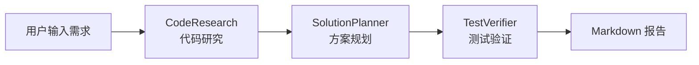

# Spring AI Code Agent

> 基于 Spring AI 的智能代码研发助手，使用 DeepSeek 大语言模型驱动的多 Agent 协作系统。

[](https://openjdk.java.net/projects/jdk/17/)
[](https://spring.io/projects/spring-boot)
[](https://spring.io/projects/spring-ai)
[](LICENSE)

---

## 📋 项目简介

本项目是一个 **AI Agent 编排系统**，通过多角色子代理协作完成代码分析与方案规划。系统接收用户的研发需求描述，自动执行以下流程：

1. **代码研究** - 分析目标项目结构与代码内容
2. **方案规划** - 基于研究结果生成实施建议
3. **测试验证** - 输出测试策略与验收标准
4. **报告输出** - 生成完整的 Markdown 实施建议报告



---

## 🏗️ 架构设计

### 模块结构

```
src/main/java/com/example/agent/
├── SpringAiCodeAgentApplication.java   # 应用启动类
├── cli/                                 # CLI 入口层
│   ├── CliInput.java                    # 命令行参数解析
│   └── AnalyzeCommand.java              # 启动入口 (CommandLineRunner)
├── core/                                # 核心编排层
│   ├── OrchestrationService.java        # 多 Agent 编排服务
│   ├── AgentTodoTracker.java            # 任务进度跟踪器
│   └── SubAgentResult.java              # 子代理结果数据类
└── subagents/                           # 子代理层
    ├── CodeResearchSubAgent.java        # 代码研究代理
    ├── SolutionPlannerSubAgent.java     # 方案规划代理
    └── TestVerifierSubAgent.java        # 测试验证代理
```

### 子代理职责

| 子代理 | 职责 | 集成工具 |
|--------|------|----------|
| **CodeResearchSubAgent** | 项目结构分析、代码内容搜索、Git 状态检查 | GrepTool, FileSystemTools, ListDirectoryTool, ShellTools |
| **SolutionPlannerSubAgent** | 基于研究结果生成变更方案与实施建议 | ChatClient (LLM) |
| **TestVerifierSubAgent** | 制定测试策略、定义验收标准 | ChatClient (LLM) |

### 工具链

项目集成 `spring-ai-agent-utils` 提供的开发工具集：

- 🔍 **GrepTool** - 代码内容正则搜索
- 📂 **ListDirectoryTool** - 目录结构浏览
- 📄 **FileSystemTools** - 文件读写操作
- 💻 **ShellTools** - Shell 命令执行（git status 等）
- ✅ **TodoWriteTool** - 任务进度追踪与写入

---

## ⚙️ 环境要求

- **JDK**: 17+
- **Maven**: 3.8+
- **DeepSeek API Key**（用于 LLM 调用）

---

## 🚀 快速开始

### 1. 克隆项目

```bash
git clone https://github.com/FanMang776/spring-ai-code-agent.git
cd spring-ai-code-agent
```

### 2. 配置 API Key

编辑 `src/main/resources/application.yml`：

```yaml
spring:
  ai:
    openai:
      api-key: your-deepseek-api-key
      base-url: https://api.deepseek.com
      chat:
        options:
          model: deepseek-chat
          temperature: 0.2
```

或通过环境变量配置：

```bash
export DEEPSEEK_API_KEY=your-deepseek-api-key
export DEEPSEEK_BASE_URL=https://api.deepseek.com
export DEEPSEEK_MODEL=deepseek-chat
```

### 3. 构建 & 运行

```bash
# 打包
mvn clean package -DskipTests

# 运行（分析指定路径的项目）
java -jar target/spring-ai-code-agent.jar analyze "需求描述" --path /path/to/target/project

# 运行（分析当前目录）
java -jar target/spring-ai-code-agent.jar analyze "实现用户认证功能"
```

### 参数说明

| 参数 | 必填 | 说明 |
|------|------|------|
| `requirement` | ✅ | 需求描述文本 |
| `--path` / `-p` | ❌ | 目标项目路径（默认为当前工作目录） |

---

## 📤 输出示例

程序运行结束后，会在控制台输出一份 **Markdown 格式的实施建议报告**：

```markdown
# 实施建议报告

## 输入信息
- 需求：xxx
- 目标路径：xxx

## Todo 进度
- [x] 代码研究
- [x] 方案规划
- [x] 测试验证

## 代码研究结果
...

## 解决方案建议
...

## 测试验证建议
...
```

---

## 🔧 技术栈

| 技术 | 版本 | 用途 |
|------|------|------|
| Java | 17 | 开发语言 |
| Spring Boot | 3.4.5 | 应用框架 |
| Spring AI | 1.0.0 | AI 集成框架 |
| DeepSeek | - | 大语言模型 |
| spring-ai-agent-utils | 0.7.0 | Agent 工具集 |

---

## 📄 License

Apache License 2.0
